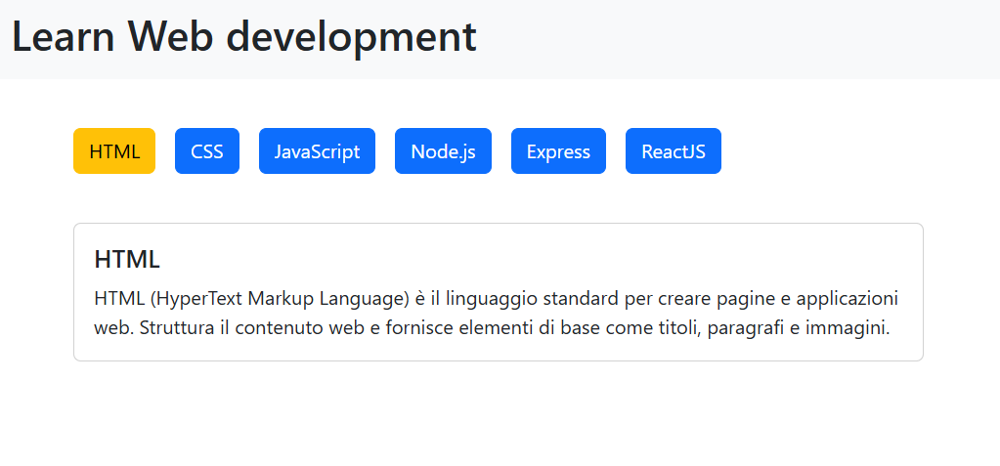

 

# Esercizio #37 | Classe 137 | Boolean Academy

---

Studente: Fabio Ferrero

---
# English

## Target of the project:
Given an array of objects containing Web languages and their descriptions:
- Create a list of buttons, one per language.
- Insert a card below showing the title and description of the first language in the array.
- Make it so that when one of the buttons is clicked, the bottom card displays the corresponding language and its description

**Bonus**
- If no language is selected, the detail card shows “no language selected”
- Give a different color to the button for which the language is currently selected.
- Decompose the detail card into a separate component that retains its functionality
- Break down buttons into separate components that retain all functionality

Translated with DeepL.com (free version)

---
# Italiano

## Obiettivo del progetto:
Dato un array di oggetti contenente i linguaggi del web e le loro descrizioni:
- Crea una lista di bottoni, uno per  linguaggio.
- Inserisci sotto una card che mostri il titolo e la descrizione del primo linguaggio nell’array.
- Fare in modo che, cliccando uno dei bottoni, la card in basso visualizzi il linguaggio corrispondente e la relativa descrizione

**Bonus**
- Se nessun linguaggio è selezionato, la card del dettaglio mostra “nessun linguaggio selezionato”
- Dare un colore diverso al bottone per cui il linguaggio è attualmente selezionato.
- Scomporre la card dei dettagli in un componente a parte che mantenga le sue funzionalità
- Scomporre i buttons in componenti a parte che mantengono tutte le funzionalità

---

